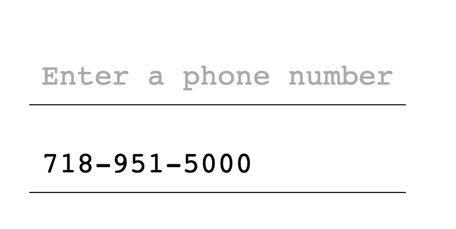

## Objective

The objective is to create an input mask that formats telephone numbers in real-time.

It should present a user entered phone number xxxxxxxx as something like xxx-xxx-xxxx. Note: Choosing the `-` here as it is slightly easier to implement than with `()` characters for `(XXX) XXX - XXXX`. We will assume US phone numbers to keep it simple. The presented example uses Brooklyn College's phone number, `718-951-5000`

The user will be entering in 1 key at a time.

When 3 characters have been entered, a `-` should append the input to yield `XXX-`.

When 6 characters have been entered, a `-` should append the input again to yield `XXX-XXX-`

And finally after 10 characters have been entered, it should not accept any further input.

## Directions

Treat the feature development as a series of steps.

*If you've considerable experience iwht JS and comfortable designing your own implementation, feel free to design and execute your vision for this telephone formatter.**

Otherwise, use the TODOs listed in the provided files is the suggested implementation tasks. Complete each of the TODOs specified, each TODO should be its own commit:

- 4 in `script.js`
- 1 in css

Those are the minimal requirements.

Enhancing the HTML would be awesome but not required. An impressive submission of this exercise may lead to extra credit points.

## Helpful hint

Use the JavaScript console of a browser to test during your development process. Instructions for accessing this console from your browser are shown at https://javascript.info/devtools

## Testing/Grading

I will be testing your work with Chrome. I will check to see that

I will count 1 point per TODO successfully completed, plus another point for submitting. Please maintain the use of vanilla JavaScript.

## References - Official specification documents

- (CSS) CSS Properties https://www.w3.org/TR/CSS/#properties
- (JS) Keyboard Events https://www.w3.org/TR/uievents/#events-keyboardevents
